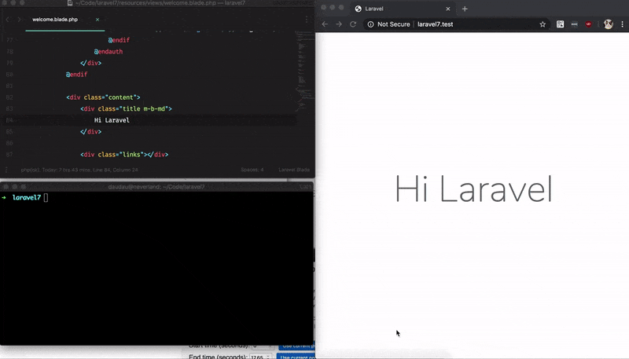

# Laravel Serve LiveReload

This package integrates into default `artisan serve` command an WebSockets server for live reloading the application when any file changed. How it works, checkout my [blog post](https://daudau.cc/posts/laravel-live-reload-without-javascript.html) for explaination if you don't like digging into source code.



## Installation

For laravel 8, please use version ^1.x, and below use version 0.x

`composer require bangnokia/laravel-serve-livereload --dev`


## Usage

Open terminal and run `php artisan serve`

This package works even when you use custom vhost such as `valet` or `laragon`

## Configuration

By default, this package looking for files changes in these directories:

```
/app
/public 
/config 
/routes 
/resources
```

If you want to customize the watched forlders, you can publish the configuration file by this commmand:

```bash
php artisan vendor:publish --provider="BangNokia\ServeLiveReload\CommandServiceProvider"
```

and then you can config what you want in the `config/serve_livereload.php`.

